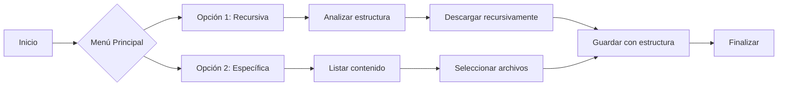

# 🚀 elhacker-downloader.sh

[](https://www.gnu.org/software/bash/)
[](LICENSE)
[](https://github.com/rodrigo47363/elhacker-downloader.sh)

Herramienta CLI avanzada para descargar cursos y recursos de [elhacker.info](https://elhacker.info) preservando la estructura de directorios original.

---

## 🔍 Descripción
**elhacker-downloader.sh** es una solución completa para administrar descargas de contenido educativo que ofrece:

- ⚡ Descarga recursiva de cursos completos
- 🎯 Selección granular de archivos específicos
- 🌐 Exploración interactiva de directorios remotos
- 📂 Preservación automática de estructura de carpetas
- 🔄 Reanudación de descargas interrumpidas
- ✨ Soporte para selección con `fzf` (experiencia mejorada)

---

## ⚙️ Instalación en 3 pasos

```bash
# 1. Clonar repositorio
git clone https://github.com/rodrigo47363/elhacker-downloader.sh.git

# 2. Navegar al directorio
cd elhacker-downloader.sh

# 3. Dar permisos de ejecución
chmod +x scripts/downloader.sh
```

---

## 📦 Dependencias Requeridas

| Herramienta | Instalación | Función |
|-------------|-------------|---------|
| `curl` | `sudo apt install curl` | Manejo de solicitudes HTTP |
| `wget` | `sudo apt install wget` | Descargas robustas |
| `pup` | `sudo apt install pup` | Parseo de HTML |
| `fzf` | `sudo apt install fzf` | Selección interactiva |

**Instalación completa (Debian/Ubuntu):**
```bash
sudo apt update && sudo apt install -y curl wget pup fzf
```

---

## 🖥️ Modo de Uso
```bash
./scripts/downloader.sh
```

### 🧩 Opciones del Menú Principal:
| Opción | Función | Atajo |
|--------|---------|-------|
| **1. Exploración recursiva** | Descarga cursos completos | Ideal para contenido extenso |
| **2. URL específica** | Descarga archivos puntuales | Precisión en selecciones |
| **3. Salir** | Finaliza el programa | `Ctrl+C` |

### 🔧 Funcionalidades Avanzadas:
- Descarga masiva automática
- Selección manual con/sin `fzf`
- Generación de estructura de directorios
- Soporte para reanudación de descargas
- Registro de actividad (logs)

---

## 📊 Flujo de Trabajo


---

## 📬 Contacto
**Rodrigo Vil**  
✉️ [rodrigovil@proton.me](mailto:rodrigovil@proton.me)  
💻 [GitHub](https://github.com/rodrigo47363)  

---

## 🌐 Redes y Comunidades
Conéctate para más contenido de seguridad:

| Plataforma | Enlace | Badge |
|-----------|--------|-------|
| **YouTube** | [Tutoriales Hacking](https://www.youtube.com/@Rodrigo-47363) | [](https://www.youtube.com/@Rodrigo-47363?sub_confirmation=1) |
| **LinkedIn** | [Perfil Profesional](https://linkedin.com/in/rodrigo-v-695728215) | [](https://linkedin.com/in/rodrigo-v-695728215) |
| **HackTheBox** | [Perfil HTB](https://app.hackthebox.com/profile/2072477) | [](https://app.hackthebox.com/profile/2072477) |
| **TryHackMe** | [Perfil THM](https://tryhackme.com/p/Rodrigo47363) | [](https://tryhackme.com/p/Rodrigo47363) |

---

## 💰 Donaciones
¿Quieres apoyar el proyecto? Aceptamos cripto:

| Criptomoneda | Dirección | 
|--------------|-----------|
| **Bitcoin** | `bc1qkzmpd0hry99qms7ef23vsyx9vt34pzzaslpp8y` |
| **Ethereum** | `0xB75bC57C54FCBFF139EBF981A596B019C537d018` |
| **Solana** | `ELekuGHcmZjhXrtHNqHuu8QmdCZr3oCWtTmu3QUQ5hac` |

---

## 🔗 Enlaces de Referido
Únete a las plataformas usando mis enlaces:

- **Hack The Box**:  
  [https://referral.hackthebox.com/mz7ZtlJ](https://referral.hackthebox.com/mz7ZtlJ)

- **TryHackMe**:  
  [https://tryhackme.com/signup?referrer=64f0d7665fde58f3ec71379b](https://tryhackme.com/signup?referrer=64f0d7665fde58f3ec71379b)

---

## 📜 Licencia
MIT License - Ver [LICENSE](LICENSE) para detalles completos.

---

## ❓ FAQ
### ¿Puedo descargar cursos completos?
✅ Sí, con la opción 1 (Exploración recursiva)

### ¿Cómo selecciono múltiples archivos?
🔢 Con `fzf`: `TAB` para seleccionar, `Enter` para confirmar

### ¿Se preservan los permisos?
🔐 No, solo estructura de directorios y contenido

---

## 🤝 Contribuciones
¡Bienvenidas todas las contribuciones!  
Flujo recomendado:


> **Nota Legal**:  
> Proyecto independiente sin afiliación oficial con elhacker.info.  
> Descarga solo contenido con permisos adecuados.
