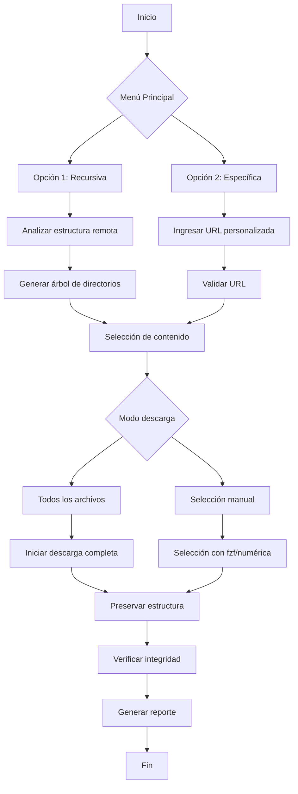

# 🚀 elhacker-downloader.sh - Descargador Profesional de Contenido Web

[](https://www.gnu.org/software/bash/)
[](LICENSE)
[](https://github.com/rodrigo47363/elhacker-downloader.sh)
[](https://github.com/rodrigo47363/elhacker-downloader.sh/releases)

Herramienta CLI avanzada para descargar cursos y recursos de [elhacker.info](https://elhacker.info) preservando la estructura de directorios original. Ideal para profesionales de ciberseguridad, estudiantes y entusiastas.


## 🔍 Descripción
**elhacker-downloader.sh** es una solución completa para administrar descargas de contenido educativo que ofrece:

- ⚡ Descarga recursiva de cursos completos con un solo comando
- 🎯 Selección granular de archivos específicos mediante interfaz interactiva
- 🌐 Exploración en tiempo real de directorios remotos antes de descargar
- 📂 Preservación automática de estructura de carpetas original
- 🔄 Reanudación inteligente de descargas interrumpidas
- ✨ Soporte para selección con `fzf` (experiencia de usuario mejorada)
- 🔐 Validación de integridad de archivos descargados

## ⚙️ Instalación Rápida

### Método 1-Línea (Recomendado)
```bash
curl -sL https://raw.githubusercontent.com/rodrigo47363/elhacker-downloader.sh/main/setup.sh | sudo bash
```

*Este comando automáticamente:*
1. Descarga el script de instalación
2. Instala dependencias necesarias
3. Configura el comando `elhacker-dl` globalmente
4. Establece permisos adecuados

### Método Manual

```bash
# 1. Clonar repositorio
git clone https://github.com/rodrigo47363/elhacker-downloader.sh.git

# 2. Navegar al directorio
cd elhacker-downloader.sh

# 3. Instalar dependencias
sudo ./scripts/install-dependencies.sh

# 4. Dar permisos de ejecución
chmod +x scripts/setup.sh

# 5. Crear acceso directo global
sudo ln -s $(pwd)/scripts/setup.sh /usr/local/bin/elhacker-dl

# 6. Verificar instalación
elhacker-dl --version
```

### Post-Instalación:
```bash
# Probar funcionalidad básica
elhacker-dl --test

# Verificar dependencias
elhacker-dl --check-deps
```

## 🛠️ Estructura de Archivos
```
elhacker-downloader.sh/
├── scripts/
│   ├── downloader.sh       # Script principal
│   ├── install.sh          # Instalador automático
│   ├── install-dependencies.sh  # Gestor de dependencias
│   └── uninstall.sh        # Script de desinstalación
├── docs/                   # Documentación técnica
├── logs/                   # Registros de actividad
├── LICENSE
└── README.md
```

## 🔄 Actualización
```bash
# Actualizar a la última versión
sudo elhacker-dl --update

# Alternativa manual:
cd ~/elhacker-downloader.sh
git pull origin main
sudo ./scripts/install-dependencies.sh
```

## 🗑️ Desinstalación
```bash
# Método automático
sudo /usr/local/bin/elhacker-dl --uninstall

# Método manual
sudo rm /usr/local/bin/elhacker-dl
rm -rf ~/elhacker-downloader.sh
```


## 📦 Dependencias Requeridas

| Herramienta | Instalación | Función |
|-------------|-------------|---------|
| `curl` | `sudo apt install curl` | Manejo de solicitudes HTTP/HTTPS |
| `wget` | `sudo apt install wget` | Descargas robustas con resumen |
| `pup` | `sudo snap install pup` | Parseo avanzado de HTML |
| `fzf` | `sudo apt install fzf` | Selección interactiva (opcional) |
| `tree` | `sudo apt install tree` | Visualización de estructura (opcional) |

**Instalación completa en Debian/Ubuntu:**
```bash
sudo apt update && sudo apt install -y curl wget tree fzf && sudo snap install pup
```

## 🖥️ Modo de Uso

### Ejecución básica
```bash
elhacker-dl
```

### Opciones avanzadas
```bash
elhacker-dl [OPCIONES]

Opciones:
  --url [URL]       Especificar URL personalizada
  --output [DIR]    Directorio de descarga personalizado
  --resume          Reanudar descargas incompletas
  --clean           Limpiar caché y archivos temporales
  --update          Actualizar a la última versión
  --version         Mostrar versión actual
```

### 🧩 Menú Interactivo
```text
╔══════════════════════════════════════╗
║   ELHACKER DOWNLOADER v1.3.0         ║
╠══════════════════════════════════════╣
║ 1. Exploración recursiva             ║
║ 2. Descarga desde URL específica     ║
║ 3. Administrar descargas             ║
║ 4. Configuración avanzada            ║
║ 5. Salir                             ║
╚══════════════════════════════════════╝
```

## 📊 Flujo de Trabajo



## 🔧 Funcionalidades Avanzadas

### Descarga Selectiva


### Gestión de Descargas
```bash
elhacker-dl --resume  # Reanuda descargas incompletas
elhacker-dl --clean   # Limpieza de archivos temporales
```

### Personalización
```bash
# Ejemplo: Descargar curso específico en directorio personalizado
elhacker-dl --url https://elhacker.info/cursos/pentesting/ \
           --output ~/Documentos/Cursos/Pentesting
```

## 📚 Casos de Uso

### Descargar curso completo
```bash
elhacker-dl
# > Seleccionar Opción 1
# > Elegir "Descargar todo"
```

### Descargar materiales específicos
```bash
elhacker-dl --url https://elhacker.info/cursos/redes/
# > Usar fzf para seleccionar archivos (TAB para multi-selección)
```

### Reanudar descarga interrumpida
```bash
elhacker-dl --resume
```

## 🛠️ Solución de Problemas

### Error: Dependencias faltantes
```bash
sudo ./scripts/install-dependencies.sh
```

### Error: Permisos insuficientes
```bash
sudo chmod +x /usr/local/bin/elhacker-dl
```

### Error: SSL/TLS
```bash
# Actualizar certificados
sudo apt update && sudo apt install --reinstall ca-certificates
```

## 🌐 Redes y Contacto

**Rodrigo Vil**  
✉️ [rodrigovil@proton.me](mailto:rodrigovil@proton.me)  
💻 [GitHub](https://github.com/rodrigo47363)  

| Plataforma | Enlace | Badge |
|-----------|--------|-------|
| **YouTube** | [Tutoriales Hacking](https://www.youtube.com/@Rodrigo-47363) | [](https://www.youtube.com/@Rodrigo-47363?sub_confirmation=1) |
| **LinkedIn** | [Perfil Profesional](https://linkedin.com/in/rodrigo-v-695728215) | [](https://linkedin.com/in/rodrigo-v-695728215) |
| **HackTheBox** | [Perfil HTB](https://app.hackthebox.com/profile/2072477) | [](https://app.hackthebox.com/profile/2072477) |
| **TryHackMe** | [Perfil THM](https://tryhackme.com/p/Rodrigo47363) | [](https://tryhackme.com/p/Rodrigo47363) |

## 💖 Apoya Mi Trabajo

<div align="center">
  
[](bitcoin:bc1qkzmpd0hry99qms7ef23vsyx9vt34pzzaslpp8y)
[](https://etherscan.io/address/0xB75bC57C54FCBFF139EBF981A596B019C537d018)
[](https://solscan.io/address/ELekuGHcmZjhXrtHNqHuu8QmdCZr3oCWtTmu3QUQ5hac)

</div>

```crypto
BTC:  bc1qkzmpd0hry99qms7ef23vsyx9vt34pzzaslpp8y
ETH:  0xB75bC57C54FCBFF139EBF981A596B019C537d018
SOL:  ELekuGHcmZjhXrtHNqHuu8QmdCZr3oCWtTmu3QUQ5hac
```


## 🔗 Enlaces de Referido

Únete a plataformas de hacking usando mis enlaces:

- **Hack The Box**  
  [https://referral.hackthebox.com/mz7ZtlJ](https://referral.hackthebox.com/mz7ZtlJ)
  ```bash
  # Código de referencia: mz7ZtlJ
  ```

- **TryHackMe**  
  [https://tryhackme.com/signup?referrer=64f0d7665fde58f3ec71379b](https://tryhackme.com/signup?referrer=64f0d7665fde58f3ec71379b)
  ```bash
  # Código de referencia: 64f0d7665fde58f3ec71379b
  ```

## 📜 Licencia
Este proyecto está bajo licencia MIT - consulta el archivo [LICENSE](LICENSE) para más detalles.

## ❓ Preguntas Frecuentes

### ¿Puedo descargar cursos completos?
✅ Sí, con la opción 1 (Exploración recursiva) se descargan todos los recursos del curso

### ¿Cómo selecciono múltiples archivos?
🔢 Con `fzf`: 
- `TAB` para seleccionar/deseleccionar
- `Ctrl+A` selecciona todos
- `Ctrl+D` deselecciona todos
- `Enter` confirma selección

### ¿Se preservan los permisos de archivos?
🔐 El script preserva la estructura de directorios y el contenido, pero no los permisos originales por limitaciones de HTTP

### ¿Es compatible con otros sitios?
🌍 El script está optimizado para elhacker.info pero puede funcionar con otros sitios estáticos similares usando la opción `--url`

---

**Nota Legal**:  
Proyecto independiente sin afiliación oficial con elhacker.info.  
Solo descarga contenido con permisos explícitos.  
El mal uso de esta herramienta es responsabilidad del usuario.
